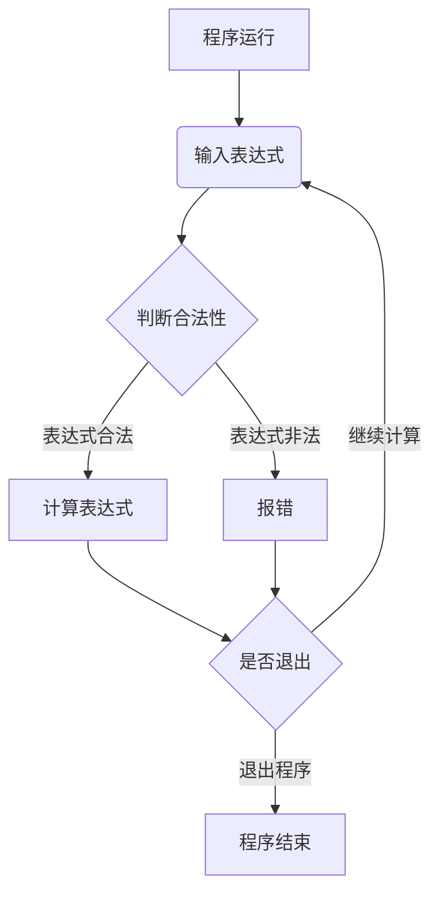

# TriFuncSolver 支持含三角函数在内的多项式计算工具

## 需求概述

项目实现一个可进行多次计算、支持三角函数计算、支持圆周率参加运算、支持浮点数计算的多项式计算器。

- 支持对多项式合法性的检验
- 支持非法多项式的报错
- 支持已计算多项式的查看

## 业务逻辑



## 架构设计

### 源文件

#### problem.cpp

实现对表达式的检验、查错、计算、查询

```c++
bool CheckProblem(Problem problem);
ErrorInfo FindError(Problem problem);
double SolveProblem(Problem problem);
void ViewProblem(Problem problem);
```

#### main.cpp

实现和用户的交互等操作，通过调用`problem.cpp`的函数实现程序功能

### 头文件

#### problem.h

定义了`struct Item`表示运算符或运算数

定义了`struct Problem`表示表达式

定义了`struct ErrorInfo`表示错误信息

```c++
struct Item
{
	char c;
	double n;
};

struct Problem
{
	vector <Item> problem;
	double answer;
};

struct ErrorInfo
{
	int error_position;
	int error_type;
};
```

### 数据结构

表达式内的运算符、运算数用向量`vector`存储

已计算的表达式用队列`queue`存储


